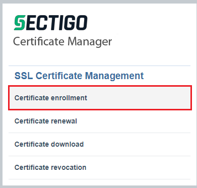
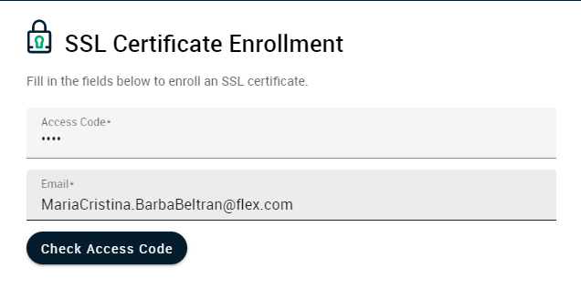

# Comodo New Certificate Enrollment

Before you continue with this step as **prerequisite**
- You should have the **CSR already generated** and available to be uploaded to Comodo. Please refer to [CSR Generation][csr-generation] for detailed documentation.
- You should have an **SCN request ticket** generated. Please refer to [SNC Request Ticket][snc-req] for detailed documentation.

Comodo is the official Flex **Certificate authority (CA)**  
What is [Comodo][comodo1]?

How to create a Comodo request

1. Navigate to [Comodo Flex page](https://hard.cert-manager.com/customer/Flex/ssl)
2. Select **Certificate enrollment** option

    

3. In the next page add the access code **2873** and your Flex email.

    

    Click on **CHECK ACCESS CODE** button  

4. in the following screen you will need to select

    - if you will request a certificate with only the server name **without** Subject Alternative Names (SNC)
        then select **EliteSSL Certificate**
        
        
        
    - ![comodo_wosnc1]

    - if you will request a certificate **with** Subject Alternative Names (SNC)
        then select **Comodo Unified Communications Certificate**
        ![comodo_wsnc1]

5. upload the CSR from the generated file at [CSR Generation][csr-generation] step
    - Click at **upload CSR** button
    ![comodo_upl1]
    - Click at **select File** button
    - locate the CSR file and click at **submit** button to submit it
    ![comodo_submitbtn1]

    **NOTE:** CSR must be loaded and Common Name and Subject Alternative Names has to be auto populated
        if this is not, CSR has an issue and you will need to troubleshoot it

6. if CSR is ok then you will see the following screen  

    ![comodo_goodscr]

7. After you need to enter a valid flex email address or distribution list  
this is important as comodo will use this email when the certificate will end and has to be renew

    ![comodo_comemail]

8. if everything is ok then you have to check the **I agree** checkbox to enable the Enroll button

    ![comodo_agree]

9. Click on **enroll** button and your certificate request will be submitted
then you will receive the following screen

    ![comodo_suc]

10. Now you need to wait until the Security Operations Team completes both the Comodo and SNC requests
    after you will receive the certificate by email.

11. Please refer to **[Download Certificate][download-cert]** document to download it

[comodo_sc1]: ./images/comodo-sc1.png
[comodo_sc2]: ./images/comodo-sc2.png
[comodo_bud1]: ./images/comodo-button1.png
[comodo_wosnc1]: ./images/comodo-wosnc.png
[comodo_wsnc1]: ./images/comodo-wsnc.png
[comodo_upl1]: ./images/comodo-uplbtn.png
[comodo_submitbtn1]: ./images/comodo-submitbtn.png
[comodo_goodscr]: ./images/comodo-goodcsr.png
[comodo_comemail]: ./images/comodo-comemail.png
[comodo_agree]: ./images/comodo-agree.png
[comodo_suc]: ./images/comodo-sucsess.png
[comodo]: https://hard.cert-manager.com/customer/Flex/ssl
[comodo1]: https://ssl.comodo.com/about-us#:~:text=Comodo%20SSL%20is%20a%20subsidiary,in%20digital%20web%20security%20solutions.&text=As%20the%20largest%20commercial%20certificate,transactions%20and%20grow%20online%20trust.
[csr-generation]: ./csr-generation.md
[snc-req]: ./snc-request-ticket.md
[download-cert]: ./download-certificates.md
