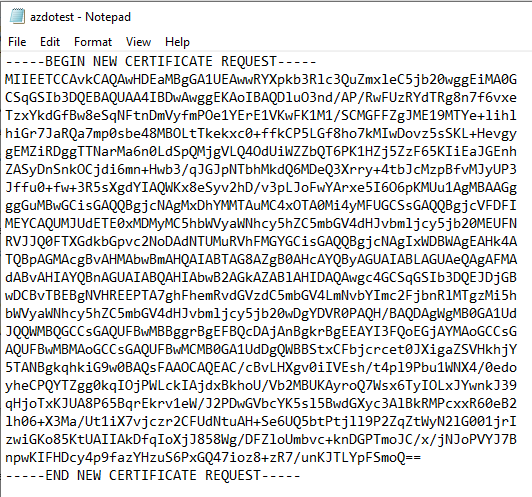

# CSR Generation

### Requesting the Certificate to enable HTTPS in Web Application at Flex

The process shown below are for certificate requests done in Windows environments.

##### Create a Certificate Request

From your computer (laptop/desktop) using Windows 10 or above, type certlm.msc in the lookup text box and open it

*Note:* It is possible that the your search shows the window below. In this case you should select "Manage computer certificates" option:

Right click on Personal/Certificates folder and select "Create Custom Request" option:

Click Next:

Select Proceed without enrollment policy:

Select PKS#10 in Request format:

Click in Properties button:

Give a friendly name for the certificate:

In Subject tab we need to add the common name, in this case the customized DNS for the server:

We also need to add the common name as an alternative name due to Chrome does not read the common name:

Add other names that the server are assigned, in this case the fully qualified name for the server FQN. It is a good idea to add the server name only to allow same region to specify only server name and will get the certificate.

*Note:* The reason to add the common name also in the alternate name is that Chrome does not read the common name anymore.

In Extensions tab, Key usage option, select Digital signature and Key encipherment to add:

In Extended Key Usage (application policies) option, select Server Authentication and Client Authentication to add:

In Private Key tab, Cryptographic Service Provider option, check "RSA, Microsoft Software Key Storage Provider". In Key Options set to 2048 and make sure you tick "Make private key exportable", so you can move the certificate from your computer/laptop to the server once you get the certificate.

In "Select Hash Algorithm" use sha256:

In the final window save it as Base 64:

The file content will be like below and we will use the content of this file for the SNX request.

Once the CSR  file is generated, you will need to open an **[SNC]** (Service Now) request ticket to request the Certificate Generation.
