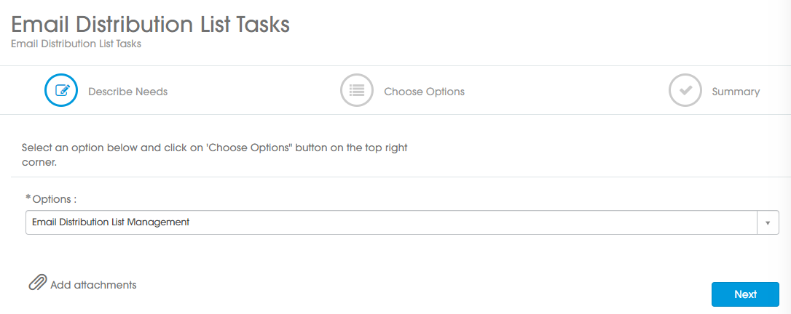
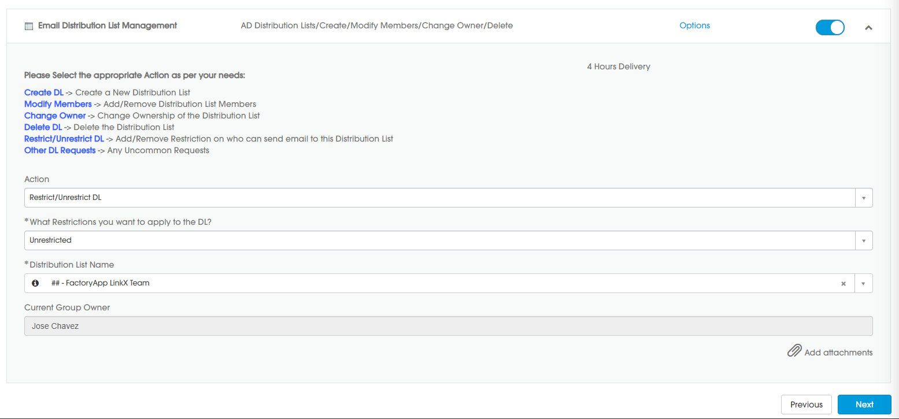
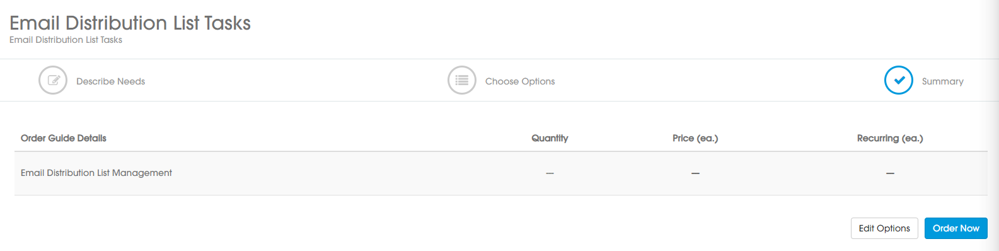

# Create a Request to enable to receive emails from external senders

In order for you to successfully complete the SNC request ticket you need to ensure that the Email Distribution List can receive mails from external senders. This is the process to do that.

- You go to SNC, "Email Distribution List Tasks" catalog and create a ticket for this, select "Email Distribution List Management" and press Next:

- Press "Options" and select the following values and press "Next":

  

In the final window (Summary) press "Order Now":

