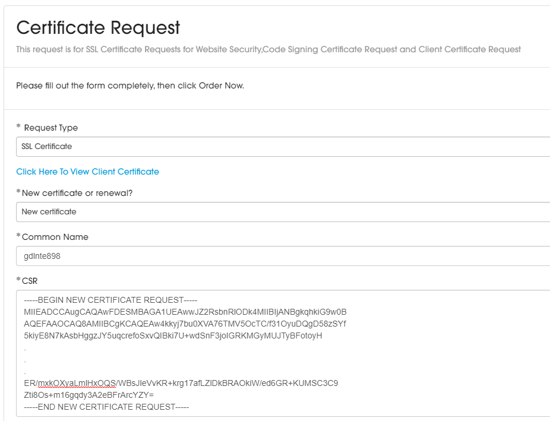
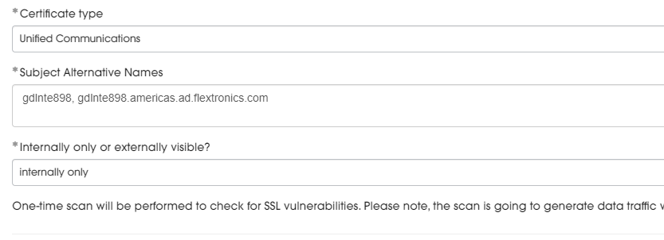
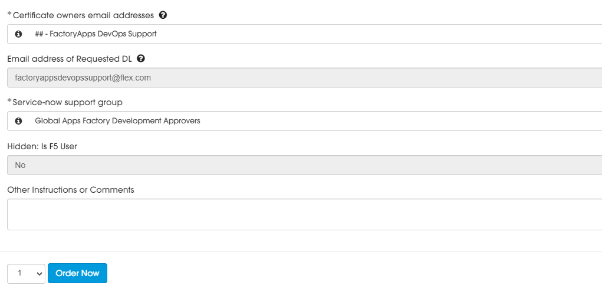

# Service Now Ticket Generation

In order for you to successfully complete the SNC request ticket you need the CSR file generated previously, therefore if you haven't created the CSR please refer to **[CSR Generation document](./csr-generation.md)**

You will need to specify and email distribution list that is allowed to received emails from outside of flex (by default those distribution lists are only visible internally). Follow [this procedure](./external-emails.md) to allow your email distribution list to receive emails from outside.

1. Once you have the REQ file, you go to SNC, Certificate Request catalog and create a ticket for this, using the following options:
    - In the request form fill at blanks as follows, copy CSR content from file and make sure you do not add any space at the end.

        

    - In Subject Alternative Names you must separate the different names by ',' (comma):

    

    - Select the team email addresses that will receive certificate installation links. Make sure the can receive mails from external senders.
    
        In case that the Email Distribution List has not enabled to receive external emails, you should create a ticket in Service Now to enable it before. Please refer to  **[Create a Request to enable to receive emails from external senders](./External_emails.md)**
    
        Press "Order Now":
    
        
    
    *Note*: The Service-now support group has to be a valid support group at this example I had chassed a generic support group but won't use it as it is owned by another Flex team. If you do not have one support group you will need to generate one before create this ticket.
    
    
    
2. Your request has been created and submitted for approval once the request gets approved the SOC's team will work on create the Certificate.

    

3. While the request gets approved you have to place a **[comodo]** request

    - To create this request please follow **[Comodo Request](./comodo-req.md)** document.

