# Hotfix process

If you are already familiar with the release process, it's time to check on the hotfix process.  
We use the recommendation from [Microsoft][microsoft].

## How to fix a released version

Let's say we have a released version 1.5.0, released under release/v1.5.

You hear about a bug which needs to be fixed. To do that you open a **hotfix** branch **on the top of release/v1.5**, and name that as hotfix/v.1.5.1.  
You will use this branch to develop the fixes. Once you commit your changes to the remote branch, the CI build will be run.

If you are happy with the results you can integrate the same to the release/v1.5 branch with a Pull Request.

From the release branch we will go through on each stages, dev, test and prod.

## How to integrate the changes to master

Obvious choice would be to pull request the changes from the release branch to master. But this is not recommended. As the article above says, you need to create a bugfix branch from the latest master and **cherry pick** this PR into that branch. Once the change is there, you can use the regular PR to integrate your changes to master, just make sure you add a new alpha version to it.

## Example

We continue with the example of we seen in the release process.

Since then a new version 1.6 also got created but a new issue detected in 1.5 and we need to fix that. Let's open a new hotfix branch from the release:

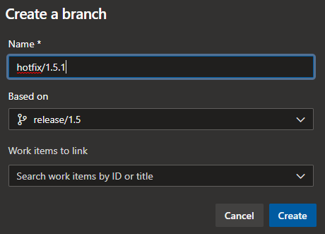

Let'c checkout that branch and perform the fix. At the end we just push the new changes.

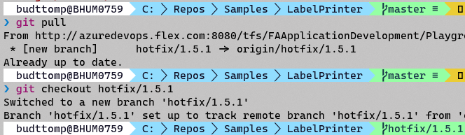

The fix is there (1 commit ahead):

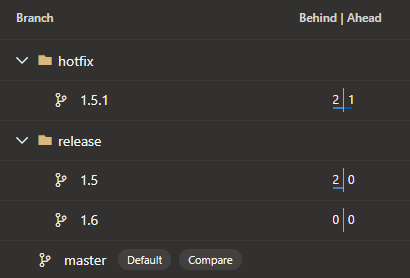

Let's integrate that to the release/1.5 with a pull request. Make sure to select the right branch! With the PR you delete the hotfix branch as well.

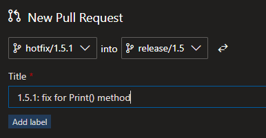

The pipeline on the release branch needs to act on the PR and start to release the changes to the stores.

Last step is to integrate the changes back to the master. To do that we create a new hotfix branch from master and then open the above PR and cherry pick that into this branch.

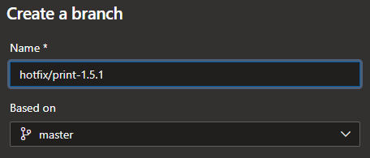

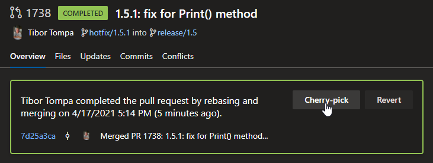

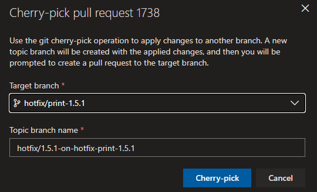

But it's a bad luck as we have conflict:

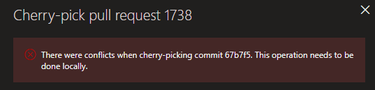

We can also use VS for the same and there you also have an option to merge:

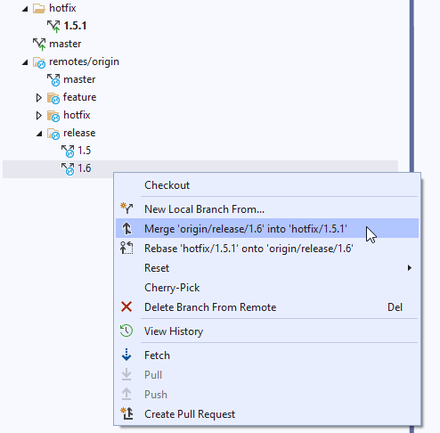

After this you need to resolve the merge conflict on your local branch:

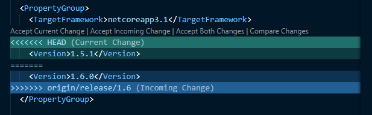

It's a bit confusing terms, I used to Accept Incoming Change to keep 1.6.0 (you can see the Current is 1.5.1 and incoming is the one you go to). You can commit that (I switched to VS Code as had some issue with a component in VS).

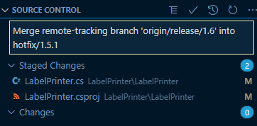

Once you pushed the commit, you can create a PR to master:

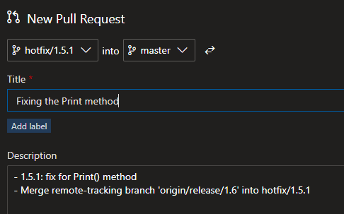

At the end everything looks good:

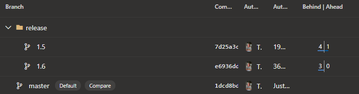

Why not going directly from Release branches to master? This way is more safe and you have the option to solve the conflicts locally (as you see, we had to). Also, using this method you can see that the 1.5 release is 1 commit ahead of master, so we already fixed something there. As we haven't went directly to master this will be always a commit ahead, even though it's integrated, but that's not a problem, you can track this with the history.

## Xtend hotfix

As written in the release guideline, it's all the same here. We need to follow the same thing for the hotfixing, only difference here is that we need to run manually the Xtend.Deploy pipeline.

Make sure to review the parameters of the pipeline!

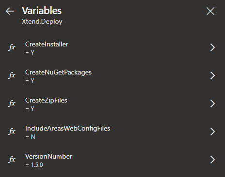

[microsoft]: https://docs.microsoft.com/en-us/azure/devops/repos/git/git-branching-guidance?view=azure-devops#manage-releases
