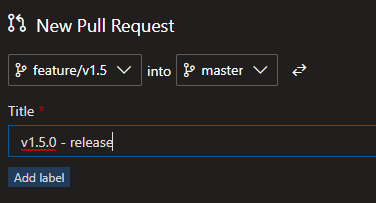

# Release process

This document is to describe the release process of Xtend or its plugins.  
This document focuses only on the regular release process, there is another one which deals with the fixes.

The main focus here are on the plugins, but below I add a section for Xtend as well.

## Branches

As release is tight to branches we need to see what kind of branches we use:

- feature/bugfix: these are the feature branches to implement a feature or to fix a bug on development time. (for ex: feature/label-printing)
- master: this is the main branch, we will start the release process here
- release/v1.0: it's a stale branch to save the state of the code upon release. We use 2 digits only!
- hotfix/v1.0.1: it's an intermittent branch to develop the hotfix, will be removed later.

### feature branches

We run the **build-ci.yml** here. No upload is made to any stores.

### master branch

Everything integrated to master will go through the release stages. We need to differentiate 2 scenarios:

- alpha versions: this needs to skip the Prod stage
- stable versions: all stages need to pass.

We run the deploy.yml pipeline here.

### release branches

We will run all stages from here, only stable versions.

## Development workflow

### Pre-release versions

When a developer is working on the code, usually we use pre-release versions, named with alpha, using feature branches.

When code is ready to try we need to upload the package to NuGet stores. This happens by integrating the code to master (with pull request). Once the code merged the release process will start.  
It will automatically uploaded to **Dev store** and if required, after a manual approval to the **Test store**. The pipeline need to ensure that alpha packages won't sent to prod.

### Stable versions

Once we are happy with the result of the last pre-release version we can release that as stable.

In the same feature branch we used, or another one, we can change the version to stable by removing the alpha tags from everywhere. Here below I have created a new branch for that and committed my version change.

We need to merge this change to the master to start the stable release.

The process is the same but this time the package will hit the Prod stage as well and will be uploaded to the **Prod store**.

We are almost complete. What is still pending is to mark this point in time to know this is our 1.5 release. There are 2 common ways to do that:

- create a branch for that
- create a tag for that

We will use branches for that as it is more visible and more similar to our previous processes. Tags are great but a bit less natural and an extra step in the deployment workflow, so we just avoid that for now.

This last step we do in Azure DevOps (but can be done on CLI, VS (Code), etc.). Let's verify the commit history on **master** if everything is good.

Yes, everything is in place, ready to roll. Let's go to the Branches menu in Azure DevOps and create a new branch:

And you are done:

Why we have used **1.5** instead of 1.5.0?

This will be more clear when we using hotfixes. We will integrate back to this branch all of the hotfixes, 1.5.1, 1.5.2, etc., so that's why we miss the last step.

## Xtend

Is there any difference when working with Xtend? Yes.

Xtend is a bigger thing with more processes, to build the installer with with different project types, etc, so we need slight changes.

We have 2 pipelines:

- Xtend.CI: verify the code with a build, running on master and feature branches
- Xtend.Deploy: it's a manual pipeline, we run this when we want to create a release with all artifacts.

Obviously, the Xtend.Deploy is what we need to take care here. When working with the Xtend code, we use the same techniques described above, at the end we will have a release/1.x branch which keeps the stable versions we release. Once we are satisfied with the contents of the release branch we can run this to create the artifacts. When running the pipeline, make sure to select the right branch. (please note, the below is not a good name, it should be release/1.5 as described above)

