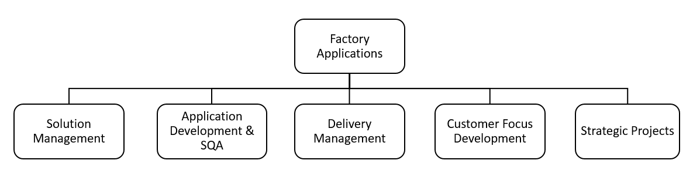

# **Organization**

**There are five main teams grouped by the three main activities in the team:**

- **Product Development**
  - Application Development & SQA
  - Solution Management

- **Project Development**

  - Delivery Management
  - Customer Focus Development

- **Strategic Projects**

  - Strategic Projects

  

## Product Development

Responsible for developing the core solutions which are generic and reusable in order to include it as part of a new version of the system.

There are three teams in Product Development: 

* ***Application Development.*** Development team in charge of designing, developing and releasing software.
* ***Software Quality Assurance.*** SQA team in charge of testing and verifying our products before going to production environment.
* ***Solution Management.*** Solution Managers and Business Analysts in charge of requirements, analysis, planning, release.

## Project Development

Responsible for developing customizations to existing core products by adding/modifying functionality without touching the core solution, and adapt it to the Project needs. Participate on Business Architecture sessions and Project Intake related activities.

* **Customer Focus Development Team.** Development team in charge of designing, developing and releasing customizations to manufacturing Projects.

* ***Delivery/Solution Management.*** Project Managers in charge of controlling Project Intake, Business Architecture discussions and Capacity Planning.

## Strategic Projects

Responsible for developing special projects/products/architecture for the next generation of shop floor applications. 
