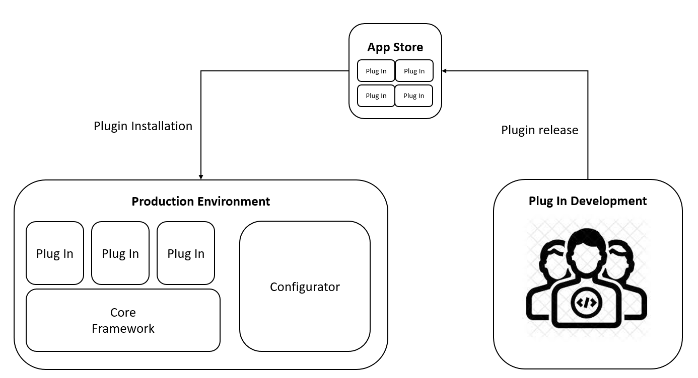

# Software Development Lifecycle (SDLC)

One important consideration about shop floor applications at flex is its high degree of customization and the need to deploy changes in production quickly and safely. In order to achieve this goal the applications are built in a way that can be customized by other teams within flex and flexibility to add functionality required by a manufacturing project. Basically a framework is developed and released, and other teams can add functionality to it. 

In order to speed up the deployment of changes, some of the applications use the Application Store concept, where independent plug ins can be added to the framework, and changes to them can be deployed to the Application Store where later the different projects can download to update that piece of functionality without making a bigger release.

## Application Store Concept

A Base Application Framework is developed to support the installation and execution of plug ins that are downloaded and installed into the application. With this model, the release of a plug in can be performed whenever a project needs the functionality without the need to wait for a new framework release. This speed up the development and deployment of new functionality in production. It also has the advantage that it is very clear the piece of functionality that is added/modified without the need to retest the whole application framework.

The major components of an application of this type are:

**Framework.** This is the base application that supports plug in installation and updates. Framework is versioned independently to the plug ins and is usually released through an installer (for new and upgrade installations). A mode advanced version of this concept allows the framework to be self updated through a framework plug in.

**Configurator.** This is a separate application that is used to install/update and configure framework and plug ins.

**PlugIns.** Individual functionality that is versioned independently and can be installed/upgraded by using the Configurator and connected to the AppStore to retrieve the new versions.

Functions or modules instead of plug ins.

modules are a set of functions

plug ins and add ins are a single function, both are a nuget package plug in.

## 